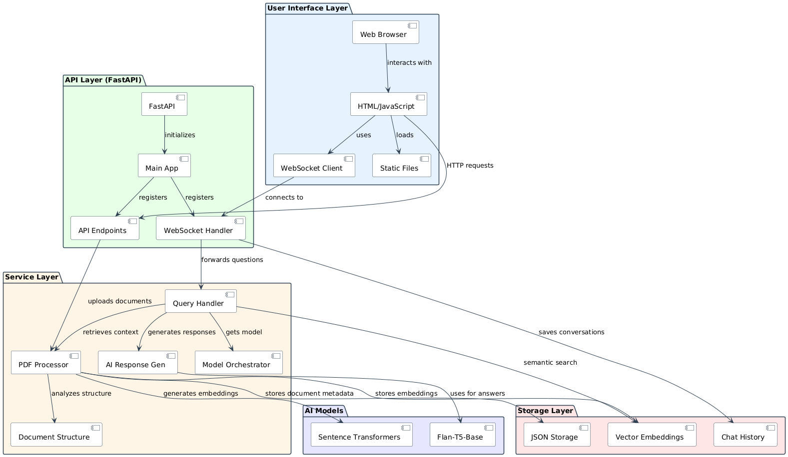

**Project Title: AlyaAloft - AI-Powered PDF Document Analysis and Question-Answering System**

---

**1. Project Overview**

AlyaAloft is a sophisticated PDF document analysis and question-answering application that leverages advanced AI models to provide detailed responses to user queries about PDF documents. This intelligent system extracts, processes, and analyzes PDF content in depth, enabling users to ask natural language questions and receive comprehensive, context-aware answers based on document content.

---

**2. Objective**

The primary objective of AlyaAloft is to revolutionize document interaction by:
- Allowing users to extract insights from PDF documents through natural language questions
- Automating document understanding using advanced AI models and vector search
- Providing comprehensive, context-aware responses that reference specific parts of documents
- Creating an intuitive interface for document uploads and conversational interaction

---

**3. Technologies and Tools**

- **Programming Language:** Python 3.9+
- **Backend Framework:** FastAPI
- **AI Models:** 
  - Flan-T5-Base (optimized for efficient inference)
  - Sentence Transformers (for text embeddings)
- **PDF Processing:** PyPDF2, pdf2image, OCR with Tesseract (optional)
- **Vector Storage:** Simple JSON-based vector store with FAISS/NumPy
- **Frontend:** HTML/CSS/JS with WebSocket for real-time chat
- **Additional Services:**
  - **pdf_processor.py:** Handles document extraction, chunking, and embedding
  - **ai_utils.py:** Manages AI models and response generation
  - **document_structure.py:** Analyzes document organization

---

**4. System Requirements**

- **Operating System:** Windows, Linux, or macOS
- **Hardware:** 
  - CPU: Modern multi-core processor (Intel i5/i7 or AMD Ryzen 5/7)
  - RAM: 8GB minimum, 16GB+ recommended
  - GPU: NVIDIA GPU with 2GB+ VRAM recommended for faster processing
  - Storage: 5GB+ available space
- **Software:** Python 3.9+, CUDA Toolkit 11.7+ (for GPU acceleration)
- **Network:** Local operation, no external API dependencies

---

**5. Setup Instructions**

**a. Environment Setup**

1. **Clone the Repository:**
   ```
   git clone https://github.com/Prathameshv07/AlyaAloft.git
   cd AlyaAloft
   ```

2. **Create and Activate Virtual Environment:**
   ```
   python -m venv venv
   # On Windows
   venv\Scripts\activate
   # On Linux/macOS
   source venv/bin/activate
   ```

3. **Install Dependencies:**
   ```
   # Windows
   pip install -r requirements-windows.txt
   # Linux/macOS
   pip install -r requirements.txt
   ```

4. **Download Models:**
   ```
   python download_model.py
   ```

**b. GPU Acceleration Setup**

1. **Verify CUDA Installation:**
   ```
   python setup_cuda.py
   ```

2. **Adjust Settings (if needed):**
   Edit `app/config.py` to adjust GPU settings and model parameters based on your hardware.

---

**6. Detailed Project Structure**

```
AlyaAloft/
├── app/
│   ├── __init__.py                # Package initialization
│   ├── main.py                    # Application entry point
│   ├── config.py                  # Configuration settings
│   ├── model_config.py            # AI model configuration
│   ├── model_orchestrator.py      # Model loading and management
│   ├── storage/
│   │   ├── __init__.py
│   │   └── json_storage.py        # JSON file storage implementation
│   ├── utils/
│   │   ├── __init__.py
│   │   ├── logging_utils.py       # Logging utilities
│   │   ├── pdf_processor.py       # PDF processing functions
│   │   ├── ai_utils.py            # AI model handling
│   │   └── document_structure.py  # Document structure analysis
│   ├── routes/
│   │   ├── __init__.py
│   │   ├── web_routes.py          # Web page routes
│   │   └── api_routes.py          # API endpoints
│   ├── static/                    # Static assets
│   ├── prompts/
│   │   └── document_prompts.py    # Prompt templates for AI models
│   └── templates/                 # HTML templates
├── data/
│   ├── chat_history/              # JSON chat history files
│   └── uploads/                   # Uploaded PDFs
├── logs/                          # Application logs
├── models/                        # AI models storage
├── scripts/                       # Utility scripts
├── tests/                         # Unit and integration tests
├── download_model.py              # Model downloader utility
├── setup_cuda.py                  # CUDA setup helper
└── requirements.txt               # Python dependencies
```

---

**7. Core Components**

- **PDF Processing Module:**  
  The `pdf_processor.py` module handles all document processing, from initial text extraction (with OCR support for scanned documents) to semantic chunking and vector embedding generation. It divides documents into meaningful segments while preserving context and creates embeddings for efficient semantic retrieval.

- **AI Response Generation:**  
  The `ai_utils.py` and `model_orchestrator.py` modules manage the loading and operation of AI models, applying sophisticated prompt templates to generate comprehensive, context-specific responses. The system uses the Flan-T5-Base model for reasoning and response generation, with optimized parameters for efficient operation.

- **Document Structure Analysis:**  
  The `document_structure.py` module analyzes document organization, identifying sections, hierarchies, and key topics to enhance context retrieval and improve answer quality by understanding document structure.

- **JSON Storage System:**  
  The `json_storage.py` module implements efficient storage mechanisms for document metadata, vector embeddings, and chat history, allowing persistent storage of conversations and document analysis results.

- **API and Web Interface:**  
  FastAPI routes in `web_routes.py` and `api_routes.py` provide both a user-friendly web interface and programmable REST API endpoints for document uploads, queries, and real-time WebSocket chat.

---

**8. Usage Guide**

**a. Running the Application:**
- Start the FastAPI server:
  ```
  python start_app.py
  ```
- The application will be available at `http://localhost:8000`

**b. Interaction Workflow:**
1. **Document Upload:** Upload a PDF document through the web interface or API
2. **Processing:** The system analyzes the document, extracts text, identifies structure, and creates embeddings
3. **Asking Questions:** Use the chat interface to ask natural language questions about the document
4. **Response Generation:** The system retrieves relevant context, applies AI reasoning, and provides detailed answers

---

**9. Sample Queries**

- "What is this document about?"
- "Summarize the key points of section 3."
- "Explain the methodology described in this paper."
- "What were the main findings discussed on page 5?"
- "What are the limitations mentioned in the conclusion?"
- "Compare the approaches described in sections 2 and 4."
- "What evidence supports the claim about X?"

---

**10. Architecture Diagram**

<div style="page-break-inside: avoid;">
  
</div>

**Key Architecture Features:**

- **Layered Architecture:** The system is organized in a modular, four-tier architecture that separates concerns and allows components to evolve independently.

- **Service-Oriented Design:** Core functionality is implemented as services (PDF processing, AI response generation, document structure analysis) that can be used by different parts of the application.

- **Vector Search:** Document content is converted to vector embeddings for efficient semantic similarity search, allowing the system to retrieve the most relevant document sections for each query.

- **Real-Time Communication:** WebSocket endpoints enable real-time chat interaction with immediate feedback as the system processes queries and generates responses.

- **Flexible Response Generation:** The system uses optimized prompt templates with the Flan-T5-Base model, applying different prompting strategies based on query types.

- **Modular AI Integration:** The model orchestrator provides a unified interface for model inference with parameters optimized for different query types.

---

**11. Optimization Features**

- **Model Parameter Tuning:** Carefully optimized model parameters for Flan-T5-Base to balance between quality and performance.

- **GPU Acceleration:** CUDA support enables faster inference on NVIDIA GPUs, with fallback to CPU when needed.

- **Chunking Strategy:** Documents are divided into semantic chunks with appropriate overlap to balance between context preservation and processing efficiency.

- **Selective Model Loading:** AI models are loaded only when needed, conserving system resources.

- **Asynchronous Processing:** FastAPI's asynchronous capabilities are leveraged for non-blocking operations, improving responsiveness.

---

**12. Future Enhancements**

- **Multi-Modal Support:** Adding capability to process images and diagrams within PDFs
- **Document Comparison:** Enabling comparison between multiple documents
- **Customizable Query Templates:** Allowing users to save and reuse common query patterns
- **Export Functionality:** Supporting export of chat sessions and insights to various formats
- **Enhanced Privacy:** Adding options for local-only processing of sensitive documents
- **Expanded Language Support:** Adding multilingual capabilities for document analysis

---

**13. License**

[](http://creativecommons.org/licenses/by-nc/4.0/)

This project is licensed under the **Creative Commons Attribution-NonCommercial 4.0 International License**.  
You are free to **use, share, and adapt** the material for **non-commercial and educational purposes**, as long as proper **credit is given** and any changes are noted.

Learn more: [http://creativecommons.org/licenses/by-nc/4.0/](http://creativecommons.org/licenses/by-nc/4.0/)