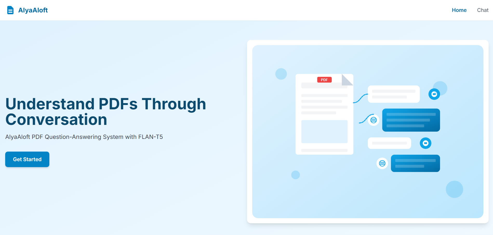

# AlyaAloft: Advanced Document Q&A with FLAN-T5



## Overview
AlyaAloft is a powerful document question-answering application that uses the FLAN-T5 language model with enhanced prompting techniques to provide high-quality responses to user queries about document content.

## Key Features

- **Advanced Prompting Techniques**: Domain-specific templates, chain-of-thought reasoning, and iterative refinement for complex questions
- **Optimized Model Performance**: 8-bit quantization for CUDA-enabled devices to reduce memory usage while maintaining quality
- **PDF Document Processing**: Extract and chunk document content for efficient retrieval
- **Conversation Memory**: Maintain context across multiple user queries
- **Responsive Web Interface**: Clean, modern UI for document upload and querying

## Model Enhancements

AlyaAloft uses several techniques to improve the quality of FLAN-T5 responses:

1. **Domain-Specific Prompting**: Automatically detects the query domain (NLP, Linguistics, Computer Science, etc.) and uses specialized prompts
2. **Question Type Detection**: Identifies query types (definition, explanation, comparison, etc.) to format prompts for optimal responses
3. **Chain-of-Thought Reasoning**: For complex questions, guides the model through a structured reasoning process
4. **Iterative Refinement**: For highly complex questions, uses a multi-stage approach to build comprehensive answers
5. **Context Preprocessing**: Formats document context for better understanding
6. **Response Enhancement**: Post-processes responses for readability and completeness

## Video Preview

<div class="iframe-container">
   <!-- Placeholder for iframe -->
   <iframe src="https://drive.google.com/file/d/1yh6PwrA9BkQT_A1Vz3L7Cna-tNLyN0TO/preview" width="100%" height="480" frameborder="0" allow="autoplay"></iframe>
</div>

## Getting Started

### Prerequisites

- Python 3.8+ with pip
- PyTorch with CUDA support (recommended for faster inference)
- 4GB+ RAM (8GB+ recommended)
- 2GB+ free disk space for models

### Installation

1. **Clone the repository**:
   ```bash
   git clone https://github.com/Prathameshv07/AlyaAloft.git
   cd AlyaAloft
   ```

2. **Create a virtual environment in python or conda**:
   ```bash
   # create a python virtual environment
   python -m venv venv
   source venv/bin/activate  # On Windows: venv\Scripts\activate

   # create a conda virtual environment
   conda create -n venv python=3.9
   conda activate venv
   ```

3. **Install dependencies**:
   ```bash
   pip install -r requirements.txt
   ```

4. **Download the FLAN-T5 model**:
   ```bash
   python scripts/download_t5_model.py
   ```
   
   For a smaller model (better for limited resources):
   ```bash
   python scripts/download_t5_model.py --model google/flan-t5-small
   ```
   
   For better quality (requires more RAM):
   ```bash
   python scripts/download_t5_model.py --model google/flan-t5-large
   ```

### Running the Application

Start the application with:

```bash
python start_app.py
```

By default, the server will run on http://127.0.0.1:8000.

Command-line options:
```bash
python start_app.py --host 0.0.0.0 --port 9000 --log-level DEBUG
```

## Usage

1. **Open the web interface** in your browser at http://127.0.0.1:8000
2. **Upload a PDF document** using the upload button
3. **Ask questions** about the document in natural language
4. **View responses** with reference to the source document

## Screenshots


## Advanced Configuration

You can customize various settings in the following configuration files:

- `app/app_config.py`: General application settings
- `app/config/model_config.py`: Model and prompting configuration

## Optimizing Performance

For best performance:

- Use a CUDA-enabled GPU with PyTorch CUDA support
- Install `bitsandbytes` for 8-bit quantization (`pip install bitsandbytes`)
- Consider adjusting the context length and batch size based on your hardware

## Troubleshooting

- **Model Loading Errors**: Check that the model files were downloaded correctly in the `models/flan-t5-base` directory
- **Memory Issues**: Try using a smaller model variant or reduce the batch size and context length in `model_config.py`
- **CUDA Errors**: Ensure your PyTorch installation supports CUDA and your GPU drivers are up to date

## Acknowledgments

- Google's FLAN-T5 model for the base language capabilities
- Hugging Face for their excellent transformers library
- FastAPI for the web framework

## License

[](http://creativecommons.org/licenses/by-nc/4.0/)

This project is licensed under the **Creative Commons Attribution-NonCommercial 4.0 International License**.  
You are free to **use, share, and adapt** the material for **non-commercial and educational purposes**, as long as proper **credit is given** and any changes are noted.

Learn more: [http://creativecommons.org/licenses/by-nc/4.0/](http://creativecommons.org/licenses/by-nc/4.0/)
